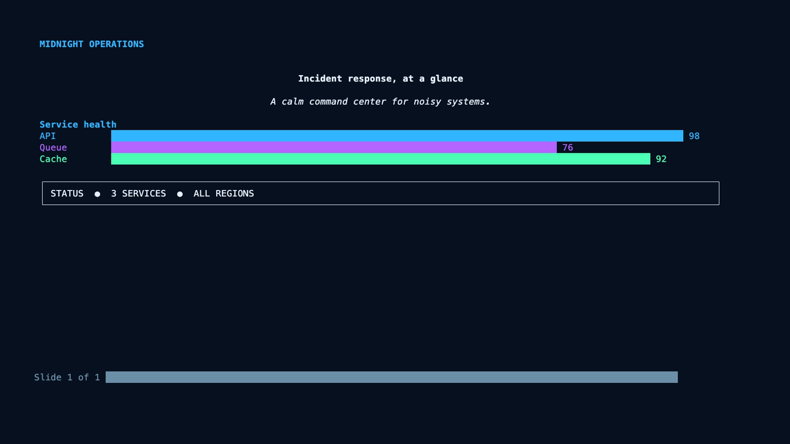
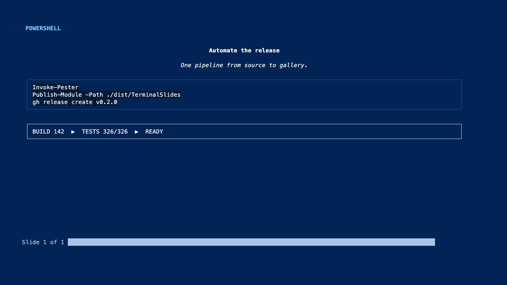
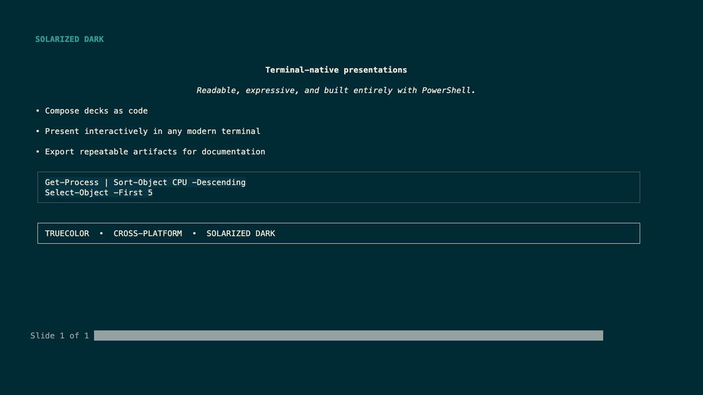
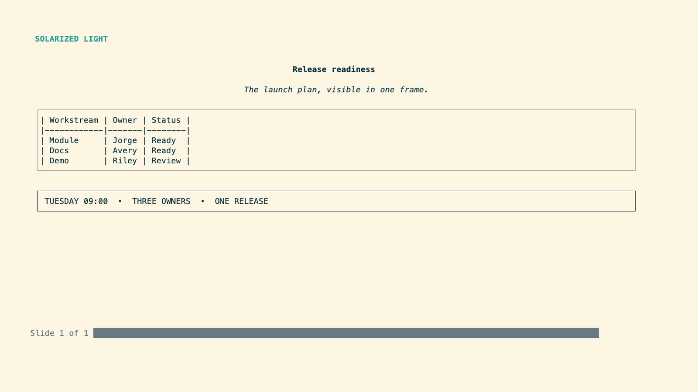
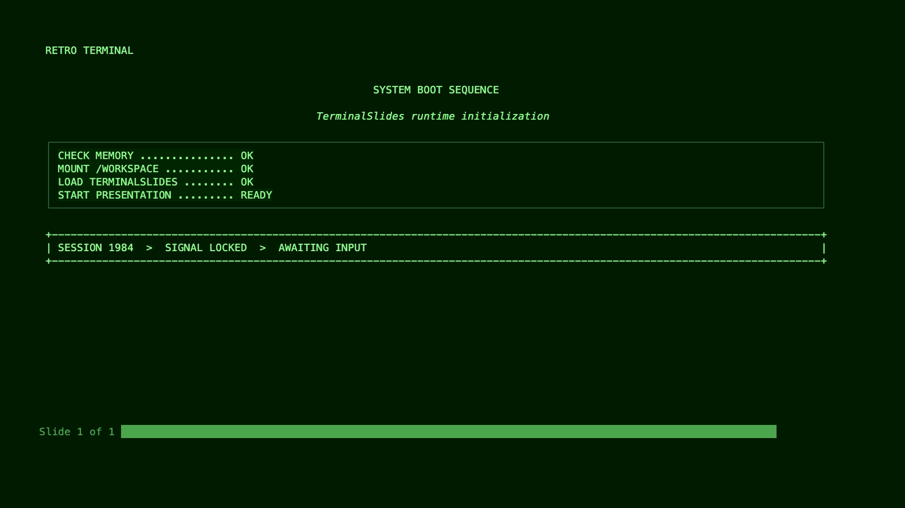
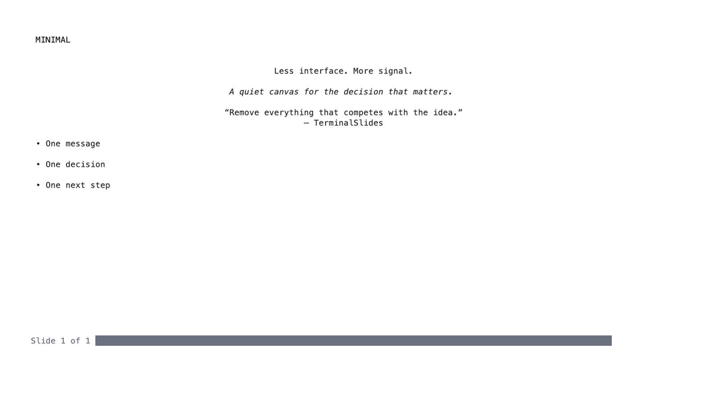
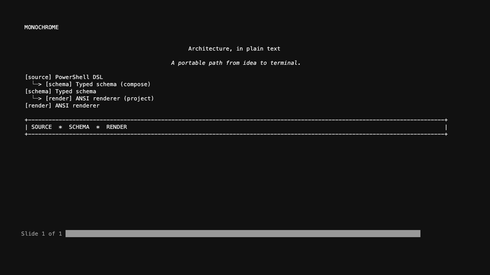
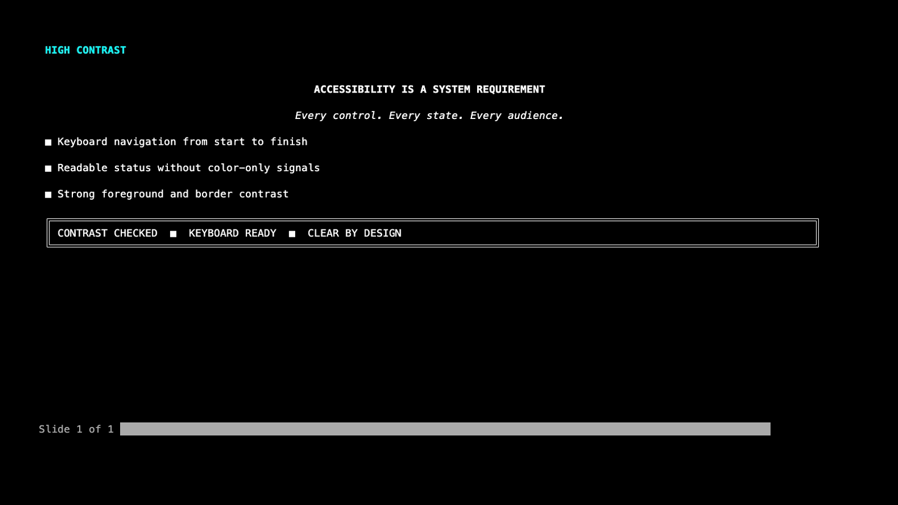

# TerminalSlides

[](https://www.powershellgallery.com/packages/TerminalSlides)
[](https://jorgeasaurus.github.io/TerminalSlides/)
[](https://github.com/PowerShell/PowerShell)
[](./LICENSE)

TerminalSlides is a cross-platform PowerShell module for building and delivering ANSI-rendered slide decks directly in the terminal.

[](./Assets/terminalslides-social-demo.mp4)

## Features

- Fluent deck-building API
- Slide DSL with text, bullets, code, charts, diagrams, tables, quotes, boxes, notes, and images
- ANSI renderer with progress bar, themes, and viewport-aware layout
- Interactive presentation mode with keyboard navigation
- Non-interactive export for CI, docs, and capture workflows
- Import/export for PSD1, JSON, Markdown, HTML, ANSI, and plain text
- Built-in themes and simple custom theme authoring

## Built-in themes

Each preview is captured from the live ANSI renderer at the same 128×32 terminal viewport.

| Midnight | PowerShell |
| --- | --- |
|  |  |
| Solarized Dark | Solarized Light |
|  |  |
| Retro Terminal | Minimal |
|  |  |
| Monochrome | High Contrast |
|  |  |

## Installation

```powershell
Install-Module TerminalSlides
```

## Quick start

```powershell
Install-Module TerminalSlides
$deck = New-TerminalPresentation -Title 'Demo'
$deck |
    Add-TerminalSlide -Title 'Hello' -Content {
        Add-SlideTitle 'Hello, Terminal'
        Add-SlideText 'This presentation is running entirely in PowerShell.'
    } |
    Add-TerminalSlide -Title 'Features' -Content {
        Add-SlideBullet 'Cross-platform'
        Add-SlideBullet 'Keyboard navigation'
        Add-SlideBullet 'ANSI rendering'
    }
Show-TerminalPresentation -Presentation $deck
```

## Built-in demos

```powershell
# TerminalSlides feature tour
Start-TerminalSlidesDemo

# Intune Hydration Kit showcase
Start-TerminalSlidesDemo -Name IntuneHydrationKit
```

## Fluent API example

```powershell
$deck = New-TerminalPresentation -Title 'Architecture' -Theme PowerShell -Author 'Jorge'
$deck |
    Add-TerminalSlide -Title 'Overview' -Content {
        Add-SlideSubtitle 'Platform highlights'
        Add-SlideBullet 'Composable slide elements' -RevealStep 1
        Add-SlideBullet 'Viewport-aware layout engine' -RevealStep 2
        Add-SlideBullet 'Cross-platform renderer' -RevealStep 3
        Add-SlideNotes 'Mention support for CI-friendly exports.'
    } |
    Add-TerminalSlide -Title 'Data' -Layout TwoColumn -Content {
        Add-SlideChart -ChartType HorizontalBar -Data @(
            @{ Label = 'Import'; Value = 92 }
            @{ Label = 'Render'; Value = 88 }
            @{ Label = 'Export'; Value = 95 }
        ) -Region Left
        Add-SlideCode -Language powershell -Code "Get-TerminalPresentationCapability | Format-List" -Region Right
    }
```

## Diagram DSL example

```powershell
$deck | Add-TerminalSlide -Title 'Flow' -Content {
    Add-SlideDiagram -Content {
        Add-SlideDiagramNode -Id A -Label 'Start'
        Add-SlideDiagramNode -Id B -Label 'Render'
        Add-SlideDiagramNode -Id C -Label 'Export'
        Add-SlideDiagramEdge -From A -To B
        Add-SlideDiagramEdge -From B -To C -Label 'Complete'
    }
}
```

## Image slide

```powershell
$deck | Add-TerminalSlide -Title 'Architecture' -Layout ImageFocus -Content {
    Add-SlideImage -Path ./architecture.png -AltText 'System architecture diagram' -Region Image
}
```

Images are scaled to their layout region and rendered as truecolor terminal cells. The manifest requires PwshSpectreConsole 2.6.3.

## Keyboard controls

| Key | Action |
| --- | --- |
| Right / Space / N / PageDown | Next reveal or slide |
| Left / Backspace / P / PageUp | Previous reveal or slide |
| Home / End | First / last slide |
| S | Toggle speaker notes |
| O | Toggle overview |
| B | Blank screen |
| T | Toggle timer |
| H / ? | Help overlay |
| Q / Escape | Quit |

## Layouts

- Title
- TitleAndContent
- SectionHeader
- TwoColumn
- ThreeColumn
- CodeFocus
- ImageFocus
- Quote
- Blank

## Export formats

```powershell
Export-TerminalPresentation -Presentation $deck -Format Html -Path ./deck.html
Export-TerminalPresentation -Presentation $deck -Format Markdown -Path ./deck.md
Export-TerminalPresentation -Presentation $deck -Format PlainText -Path ./deck.txt
Export-TerminalPresentation -Presentation $deck -Format Psd1 -Path ./deck.psd1
```

## Terminal compatibility

- Best experience: Windows Terminal, iTerm2, modern Linux/macOS terminals, VS Code integrated terminal
- Interactive mode requires a TTY and keyboard input
- Non-interactive mode automatically renders sequential slides without alternate-buffer control
- Themes use truecolor when available and fall back to plain text export when ANSI is not supported

## Development

```powershell
./build.ps1
```

## Contributing

See [CONTRIBUTING.md](./CONTRIBUTING.md) for setup and contribution guidance.
